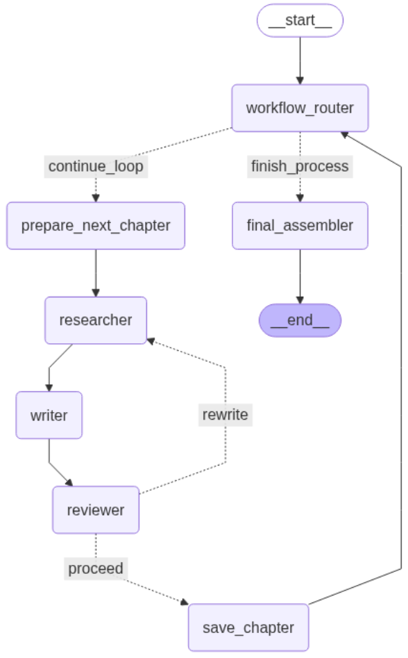
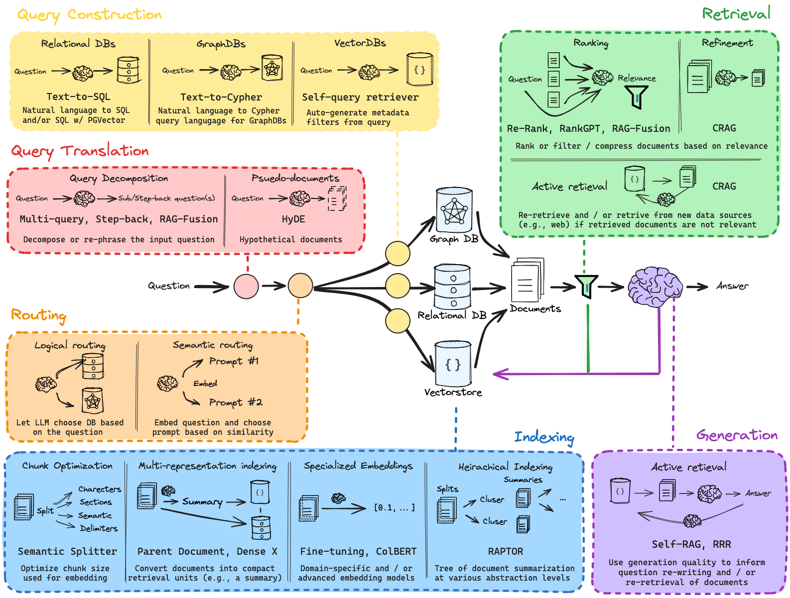

## AI Document Generation Agent

This project showcases a sophisticated multi-agent system designed to automate the creation of comprehensive documents. By orchestrating a team of specialized AI agents, it transforms a structured outline into a complete, polished document. The system follows a systematic, chapter-by-chapter process, ensuring each section is well-researched, contextually relevant, and rigorously reviewed before final assembly.

### The Agent Workflow

The agent's operation is managed by LangGraph, which coordinates the workflow between different specialized agents. The process begins with an initial plan and cycles through research, writing, and review for each chapter until the entire document is complete.

The process kicks off when the user provides a document outline. The `workflow_router` acts as the central controller, deciding whether to process another chapter or finalize the document.

If chapters remain, the flow enters a **creation loop**:
1.  **Prepare:** The `prepare_next_chapter` node selects the next chapter from the outline.
2.  **Research:** The `researcher` agent gathers relevant information from the knowledge base.
3.  **Write:** The `writer` agent synthesizes the research and drafts the chapter's text based on the outline's instructions.
4.  **Review:** The `reviewer` agent assesses the draft for quality and accuracy. If it's unsatisfactory, it's sent back for a `rewrite`. Otherwise, the flow `proceed`s.
5.  **Save:** The approved text is saved, and the process loops back to the `workflow_router` to begin the next chapter.

Once all chapters are approved, the `workflow_router` directs the process to the `final_assembler`, which compiles the chapters into a single, cohesive document.



### Project Structure

The project's architecture is designed for modularity, with each component's role clearly defined.

```
DOCUMENT_GENERATION_AGENT/
├── agent/
│   ├── final_assembler/
│   ├── prepare_chapter/
│   ├── researcher/
│   ├── reviewer/
│   ├── save_chapter/
│   ├── workflow_router/
│   ├── writer/
│   ├── graph.py
│   └── state.py
├── data/
├── output/
├── main.py
├── pyproject.toml
...
```

*   **`agent/`**: This directory contains the core logic of the system.
    *   Each subdirectory (e.g., `researcher/`, `writer/`) contains the logic for a specific agent, corresponding to a node in the workflow graph.
    *   `graph.py` defines the workflow itself, connecting the agents and defining the flow of logic using LangGraph.
    *   `state.py` defines the shared state object that is passed between the nodes.
*   **`data/`**: This folder holds the input files, including the `outline.md` (the document plan) and the `knowledge_base.md` (the information source).
*   **`output/`**: The final, assembled document is saved here.
*   **`main.py`**: The main entry point to start the agent and run the entire document generation process.
*   **`pyproject.toml`**: Defines project metadata and dependencies.

### How to Run the Agent

This project uses `uv` for fast and efficient environment and package management.

#### 1. Setup Your Environment

With `uv` installed, create and activate a virtual environment from the project's root directory.

```bash
# Create and activate the virtual environment
uv venv
source .venv/bin/activate

# Install dependencies using uv
uv sync
```

#### 2. Run the Agent

Once your environment is set up and the dependencies are installed, you can start the document generation process:

```bash
python main.py
```

The final assembled document will be saved in the `output/` directory.

### 3. Potential Improvements

While the current system provides a proof-of-concept, several areas offer opportunities for significant enhancement:

#### A. Advanced RAG Pipeline
The current research step uses a basic retrieval mechanism. This could be substantially improved by implementing a more advanced Retrieval-Augmented Generation (RAG) pipeline. Techniques inspired by resources like [LangChain's RAG From Scratch](https://github.com/langchain-ai/rag-from-scratch) could be integrated, such as:
*   **Sentence-Window Retrieval:** Fetching context surrounding a retrieved sentence to provide better local context.
*   **Re-ranking Models:** Using a lightweight model to re-rank the initial retrieved documents for higher relevance before passing them to the writer agent.
*   **Query Transformations:** Expanding the query with techniques like HyDE (Hypothetical Document Embeddings) to improve retrieval accuracy.


Source: https://github.com/langchain-ai/rag-from-scratch

#### B. Parallelized Processing
The current workflow processes each chapter sequentially. However, the research step for all chapters is independent and could be parallelized. By performing context retrieval for all chapters at the beginning of the workflow, the total runtime could be significantly reduced, especially for documents with many chapters. The system would gather all necessary context upfront, allowing the sequential writing and review loop to proceed without waiting for research at each step.

#### C. Enhanced Context Aggregation
Currently, the `researcher` passes a list of raw text chunks to the `writer`. The quality of the generated text could be improved by adding an aggregation or synthesis step. Instead of raw chunks, the system could:
*   **Summarize Context:** Use an LLM to generate a concise summary of the key points from all retrieved chunks for a given chapter.
*   **Extract and Synthesize:** Create a "synthesis" of the retrieved information, which is more structured than raw text but less polished than the final draft.
This pre-processing would reduce the cognitive load on the `writer` agent, allowing it to focus on prose and structure rather than sifting through potentially redundant information.

#### D. Systematic Prompt Evaluation
The prompts for the `writer`, `reviewer`, and other agents are critical to the quality of the final output. Rather than relying on manual tuning, a systematic evaluation framework should be implemented. This involves:
*   **Creating a "Golden Dataset":** Developing a set of test cases with ideal inputs and desired outputs.
*   **Automated Evaluation:** Using evaluation tools (like LangSmith or open-source libraries) to run different prompt variations against the dataset and measure performance based on metrics like relevance, coherence, and accuracy. This data-driven approach to prompt engineering ensures more reliable and consistent performance.